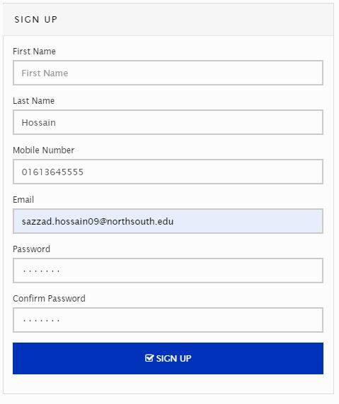
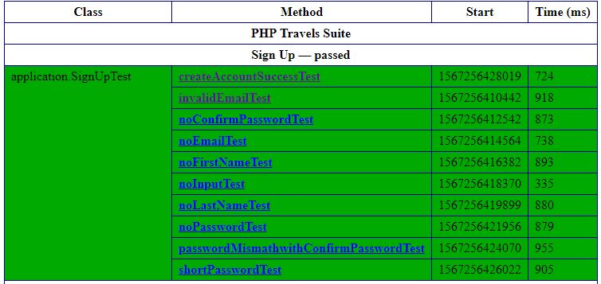
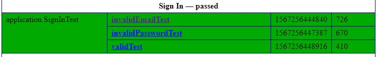
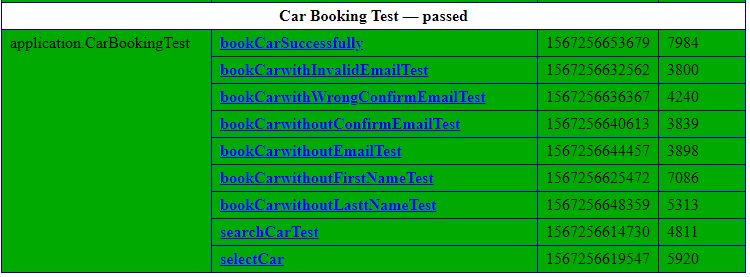
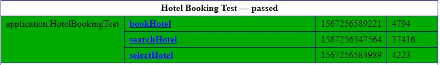
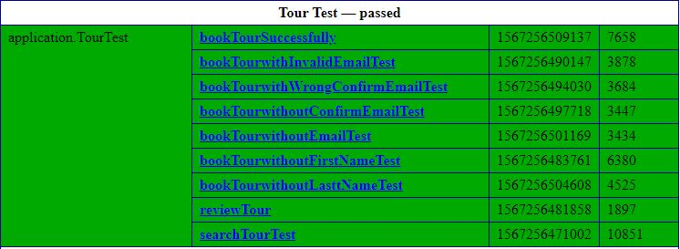
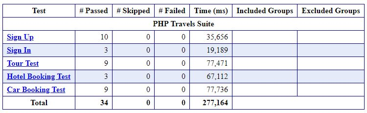

<p align="center">

</p>

<div align="center">


# North South University </h5>
##  Department of Electrical and Computer Engineering </h3>

##  Project Report

## Project Name : Test Automation Using Selenium and Java

**Course:** CSE434

**Semester:** Summer19

**Name:** Md Sazzad Hossain

**ID:** 1611235042

**Faculty:** Shaikh Shawon Arefin Shimon (SAS3)

**Section:** 01

**Email:** sazzad.hossain09@northsouth.edu

**Github Repository:** [CSE434 (Project 2)](https://github.com/sazzadhrz/CSE434/tree/master/Project02)

</div>


### Project Description:

This project is done as a part of Software Quality Assurance and Testing course. In this project the concepts of **Test Automation** have been used. A live website named [PHPTravels](https://www.phptravels.net) has been tested using *Black Box* testing concepts. 

#### Tools Used:
* Selenium (Version 3.141.59)
* TestNG (Version 7.0.0)

#### Programming Language:
* Java


### Test Explanation

The following image is a form to create a new user account. Page link [here](https://www.phptravels.net/register). Using selenium library, values have been entered into the form for every field except for the `First Name` to `Test` if it creates an account without any first name.
 
<p align="center">

</p>
<p align="center">Sign Up Test Without First Name</p>


##### Code Snippet:

```` java
	@Test 
	public void noFirstNameTest() {
		driver.findElement(By.name("lastname")).sendKeys("Hossain");
		driver.findElement(By.name("phone")).sendKeys("01613645555");
		driver.findElement(By.name("email")).sendKeys("sazzad.hossian09@northsouth.edu");
		driver.findElement(By.name("password")).sendKeys("haha123");
		driver.findElement(By.name("confirmpassword")).sendKeys("haha123");
		
		driver.findElement(By.className("signupbtn")).click();
		
		//parameter = expected error message
		scrollUpandGetWarningTextandAssert("The First name field is required."); 
	}
````

In this test method the webdriver using `findElement` method to find the desired field. To find the field specifically it uses `By` class. The `By` class uses its method to find the correct element. In this case `name` is used to find the text fields by their name. Later, user input has been entered by using the `sendKeys` method. The values passed as parameter of `sendKeys` method.

When all the input fields are filled up with user input, the driver finds the `Sign Up` button by using its class name and click on it using the `click` method. After then, the following method is called with the parameter of *desired error message*.


```` java
	public void scrollUpandGetWarningTextandAssert(String expectedWarning) {
		js.executeScript("scroll(0, -200);");	//scroll up to check the error message	
		driver.manage().timeouts().implicitlyWait(5, TimeUnit.SECONDS);

		//finding the error message
		String warning = driver.findElement(By.cssSelector("div.alert.alert-danger p")).getText();  
		System.out.println(warning); //print the error message into console

		//comparing the error message with expected message
		Assert.assertEquals(warning, expectedWarning); 
	}
````

This method scrolls the webpage to the very top to access the shown error message. It gets the warning message and saves it in a variable named `warning`. Then the warning is compared with the expectedWarning. If they matches, the `assertEquals` method will return `true`, else it will return `false`. the assertEquals method belong to class named `Assert`.

If `assertEquals` methos returns true then the test case passes, else it fails the test.

### Test Results:

#### Sign Up Test -
<p align="center">

</p>

#### Sign In Test -
<p align="center">

</p>

#### Car Boooking Test -
<p align="center">

</p>

#### Hotel Booking Test -
<p align="center">

</p>

#### Tour Booking Test -
<p align="center">

</p>

#### Test Suite -
<p align="center">

</p>